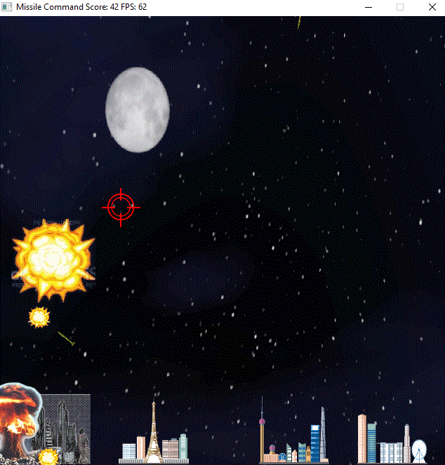

# CPPND: Capstone: Missile Command

This is a remake of the classic arcade game Missile Command, for the Capstone project in the [Udacity C++ Nanodegree Program](https://www.udacity.com/course/c-plus-plus-nanodegree--nd213).  The code used the Udacity Snake Game starter code (https://github.com/udacity/CppND-Capstone-Snake-Game) as a starting point.

## Features
Hostile missiles rain down to destroy your cities.  Some are smart missiles, and will try to dodge missiles ahead of them.

Clicking on the screen will launch a missile in a straight line to the cursor location, where it will detonate, destroying nearby missiles.

Score increments every second by the number of surviving cities.

Only one missile base has been implemented, and the player has infinite missiles.

## Code Structure
All files except airSpace.cpp and airSpace.h follow the Snake Game starter code.  Controller has been modified to use mouse input.  Renderer has been modified to load external textures.

Game has been gutted to be a generic game engine.  All Missile Command specific logic has been implemented in AirSpace.

## Rubric Points
The project demonstrates an understanding of C++ functions and control structures. - various, airSpace.cpp 28 onwards
The project reads data from a file and process the data, or the program writes data to a file. - renderer.cpp 5
The project accepts user input and processes the input. - controller.cpp 15
The project uses Object Oriented Programming techniques. - airSpace.h 24
Classes use appropriate access specifiers for class members. - airSpace.h 24
Class constructors utilize member initialization lists. - renderer.cpp 19, albeit only a slight modification of the starter code
Classes abstract implementation details from their interfaces.  - airSpace.h 24
Classes follow an appropriate inheritance hierarchy.  - airSpace.h 24
Derived class functions override virtual base class functions.  - airSpace.h 27
The project makes use of references in function declarations. - airSpace.cpp 12, 24
The project uses smart pointers instead of raw pointers. - airSpace.h 102, though I'm not sure it's necessary
The project uses multithreading. - airSpace.cpp 37.  Definitely not necessary here; purely done to play with Multithreading.
A promise and future is used in the project. - airSpace.cpp 37

## Dependencies for Running Locally
* cmake >= 3.7
  * All OSes: [click here for installation instructions](https://cmake.org/install/)
* make >= 4.1 (Linux, Mac), 3.81 (Windows)
  * Linux: make is installed by default on most Linux distros
  * Mac: [install Xcode command line tools to get make](https://developer.apple.com/xcode/features/)
  * Windows: [Click here for installation instructions](http://gnuwin32.sourceforge.net/packages/make.htm)
* SDL2 >= 2.0
  * All installation instructions can be found [here](https://wiki.libsdl.org/Installation)
  >Note that for Linux, an `apt` or `apt-get` installation is preferred to building from source. 
* gcc/g++ >= 5.4
  * Linux: gcc / g++ is installed by default on most Linux distros
  * Mac: same deal as make - [install Xcode command line tools](https://developer.apple.com/xcode/features/)
  * Windows: recommend using [MinGW](http://www.mingw.org/)

## Basic Build Instructions

1. Clone this repo.
2. Adjust 'CMakeLists.txt' to accomodate the local environment.
2. Make a build directory in the top level directory: `mkdir build && cd build`
3. Compile: `cmake .. && make`
4. Run it: `./SnakeGame`.
